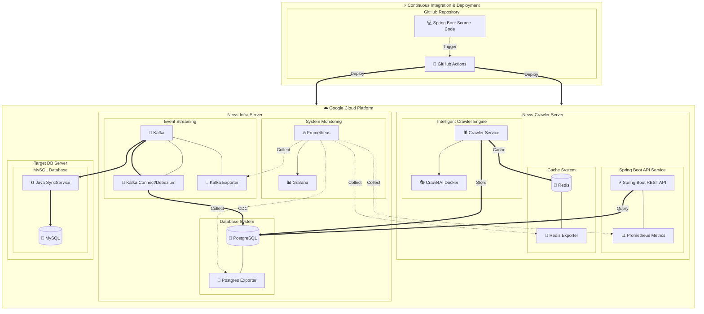

# 뉴스 크롤링 ETL 파이프라인

Spring Boot 기반의 실시간 뉴스 크롤링 시스템으로, Crawl4AI를 활용한 지능형 웹 크롤링과 CDC(Change Data Capture) 패턴을 통한 데이터 스트리밍 파이프라인을 구현합니다. 네이버 뉴스를 크롤링하여 PostgreSQL에 저장하고, Debezium을 통해 Kafka로 변경 사항을 실시간으로 전파하여 다양한 데이터베이스와 동기화하는 현대적인 데이터 아키텍처를 제공합니다.

## 🏗️ 시스템 아키텍처

## 🔍 핵심 기능 및 특징

### 지능형 크롤링 엔진
Spring Boot 기반의 마이크로서비스 아키텍처로 구현된 크롤링 서비스는 Crawl4AI Docker 컨테이너와 통합되어 고성능 웹 크롤링을 제공합니다. 네이버 뉴스의 다양한 카테고리(정치, 경제, 사회, 생활문화, 세계, IT과학, 스포츠)를 지원하며, CSS 선택자 기반의 정확한 데이터 추출과 중복 제거 기능을 포함합니다.

### 실시간 데이터 스트리밍
PostgreSQL의 WAL(Write-Ahead Log)을 기반으로 한 CDC 메커니즘을 통해 데이터 변경 사항을 실시간으로 감지합니다. Debezium Kafka Connect가 이러한 변경 사항을 Kafka 토픽으로 스트리밍하여, 다운스트림 시스템들이 즉시 데이터를 동기화할 수 있도록 합니다.

### 고급 크롤링 전략
기본 크롤링 방식 외에도 BFS(Breadth-First Search) Deep Crawling 기능을 제공하여 계층적 웹사이트 구조를 효율적으로 탐색합니다. 이를 통해 단일 페이지 크롤링보다 더 포괄적인 데이터 수집이 가능하며, 스트리밍 모드를 통해 실시간 진행 상황 추적이 가능합니다.

### 포괄적 모니터링 시스템
Prometheus와 Grafana를 활용한 실시간 모니터링 대시보드를 제공합니다. 크롤링 성능 지표, 시스템 리소스 사용량, 데이터베이스 성능, Kafka 메시지 처리량 등을 종합적으로 모니터링하여 시스템 운영 상태를 실시간으로 파악할 수 있습니다.

### 확장 가능한 아키텍처
마이크로서비스 패턴과 컨테이너 기반 배포를 통해 각 컴포넌트를 독립적으로 확장할 수 있습니다. Redis를 통한 캐싱 계층과 연결 풀 관리를 통해 고가용성과 성능을 보장합니다.

## 📊 시스템 구성요소

### 크롤링 서비스 계층
Spring Boot 애플리케이션은 RESTful API를 통해 크롤링 작업을 관리하며, JPA를 활용한 데이터 영속성과 Redis를 통한 캐싱을 제공합니다. Crawl4AI Docker 컨테이너와의 통신을 통해 실제 웹 크롤링을 수행하고, 추출된 데이터를 구조화하여 저장합니다.

### 데이터 저장 계층
PostgreSQL 데이터베이스는 WAL 레벨을 논리적 복제로 설정하여 CDC 기능을 지원합니다. 기사, 미디어, 카테고리 정보를 체계적으로 저장하며, 인덱싱을 통해 검색 성능을 최적화합니다.

### 스트리밍 계층
Kafka를 중심으로 한 이벤트 스트리밍 아키텍처는 데이터 변경 사항을 실시간으로 전파합니다. Debezium 커넥터가 PostgreSQL의 변경 로그를 모니터링하여 Kafka 토픽으로 전송하며, 다양한 컨슈머 서비스가 이를 소비하여 데이터를 동기화합니다.

### 동기화 서비스
Java로 구현된 SyncService는 Kafka 컨슈머로 동작하여 MySQL 데이터베이스와 실시간 동기화를 수행합니다. 배치 처리와 트랜잭션 관리를 통해 데이터 일관성을 보장하며, 오류 복구 메커니즘을 포함합니다.

## 🚀 설치 및 실행

### 사전 요구 사항
Docker 및 Docker Compose가 설치되어 있어야 하며, 최소 8GB RAM과 충분한 디스크 공간이 필요합니다. Java 21과 Gradle이 로컬 개발 환경에 설치되어 있어야 합니다.

### 환경 설정
프로젝트 루트의 `.env` 파일을 통해 데이터베이스 연결 정보, Redis 설정, Kafka 브로커 정보 등을 구성합니다. 각 서비스별로 적절한 메모리 할당과 포트 매핑을 설정해야 합니다.

### 인프라 서비스 실행
먼저 인프라 서비스들(PostgreSQL, Kafka, Redis, Prometheus, Grafana)을 시작합니다. 이후 Debezium 커넥터를 설정하여 CDC 파이프라인을 활성화하고, MySQL 동기화 서비스를 구동합니다.

### 크롤러 서비스 배포
Spring Boot 애플리케이션을 빌드하고 Docker 컨테이너로 배포합니다. Crawl4AI 서비스와의 연결을 확인한 후, API 엔드포인트를 통해 크롤링 작업을 시작할 수 있습니다.

## 📋 API 엔드포인트

### 크롤링 관리
기본 크롤링 시작을 위한 `POST /api/v1/crawl/basic` 엔드포인트와 BFS Deep Crawling을 위한 `POST /api/v1/crawl/deep` 엔드포인트를 제공합니다. 특정 카테고리만 크롤링하려면 `POST /api/v1/crawl/{category}` 엔드포인트를 사용할 수 있습니다.

### 상태 모니터링
현재 크롤링 상태는 `GET /api/v1/status`를 통해 확인할 수 있으며, 상세한 통계 정보는 `GET /api/v1/status/stats`에서 조회 가능합니다. 시스템 메트릭은 `GET /api/v1/metrics` 엔드포인트에서 확인할 수 있습니다.

### 데이터 조회
수집된 기사 목록은 `GET /api/v1/articles`를 통해 페이징과 필터링을 지원하며, 개별 기사는 `GET /api/v1/articles/{id}`로 조회 가능합니다. 카테고리별 통계는 `GET /api/v1/articles/stats`에서 제공됩니다.

## 📊 모니터링 및 관리

### 성능 메트릭
Prometheus를 통해 수집되는 메트릭에는 크롤링 성공률, 처리 시간, 메모리 사용량, 데이터베이스 연결 수 등이 포함됩니다. 이러한 메트릭은 Grafana 대시보드를 통해 시각화되어 실시간 모니터링이 가능합니다.

### 로그 관리
구조화된 로깅을 통해 각 컴포넌트의 동작 상태를 추적할 수 있으며, 에러 발생 시 상세한 스택 트레이스와 컨텍스트 정보를 제공합니다. 로그 레벨은 환경별로 조정 가능합니다.

### 헬스체크
각 서비스는 독립적인 헬스체크 엔드포인트를 제공하여 서비스 상태를 실시간으로 모니터링할 수 있습니다. 의존성 서비스들의 연결 상태도 함께 확인됩니다.

## 🔮 향후 개발 계획

### 스트리밍 최적화
크롤링 작업의 스트리밍 방식 전환을 통해 메모리 효율성을 개선하고 실시간 진행 상황 추적을 강화할 예정입니다. 이를 통해 대용량 크롤링 작업의 안정성과 모니터링 가능성을 향상시킬 것입니다.

### 지능형 성능 최적화
성능 지표 기반의 적응형 크롤링 시스템을 구축하여 사이트별 최적 크롤링 전략을 자동으로 학습하고 적용할 계획입니다. 이를 통해 크롤링 시간을 대폭 단축하고 서버 부하를 최소화할 것입니다.

### 멀티 컨테이너 확장
다중 Crawl4AI 컨테이너를 활용한 병렬 크롤링 시스템을 구축하여 처리량을 확장할 예정입니다. 로드 밸런싱과 작업 분산을 통해 대규모 크롤링 작업의 효율성을 크게 향상시킬 것입니다.

### AI 기반 콘텐츠 분석
LLM을 활용한 기사 내용 분석 및 키워드 추출 기능을 추가하여 수집된 데이터의 가치를 높일 계획입니다. 감정 분석, 주제 분류, 중요도 평가 등의 기능을 통해 더욱 지능적인 뉴스 큐레이션 시스템을 구축할 것입니다.

### 적응형 데이터 수집
키워드 기반 동적 크롤링 시스템을 개발하여 트렌드에 따라 수집 범위를 자동으로 조정하는 기능을 추가할 예정입니다. 이를 통해 사용자 관심사와 시장 동향에 맞춘 맞춤형 뉴스 수집이 가능해질 것입니다.

## 📖 기술 스택

### 백엔드 프레임워크
Spring Boot 3.1.5를 기반으로 하여 현대적인 Java 21 기능을 활용하며, Spring Data JPA를 통한 데이터 접근과 Spring WebFlux를 통한 비동기 처리를 지원합니다.

### 데이터베이스 및 캐싱
PostgreSQL을 주 데이터베이스로 사용하며 CDC 기능을 위한 논리적 복제를 설정하고, Redis를 통한 캐싱으로 성능을 최적화합니다. MySQL은 동기화 대상 데이터베이스로 활용됩니다.

### 메시징 및 스트리밍
Apache Kafka를 중심으로 한 이벤트 스트리밍 아키텍처를 구축하며, Debezium을 통한 CDC 구현과 KRaft 모드를 통한 ZooKeeper 의존성 제거로 아키텍처를 단순화합니다.

### 모니터링 및 관측성
Prometheus를 통한 메트릭 수집, Grafana를 통한 시각화, Spring Boot Actuator를 통한 애플리케이션 모니터링을 제공하여 종합적인 시스템 관측성을 보장합니다.
