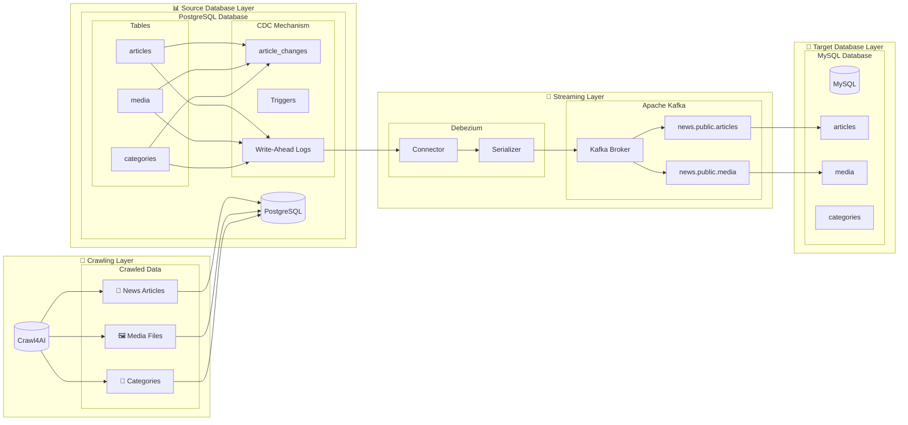

# ETL 파이프라인 구축하기 + Naver 기사 크롤링
ETL 파이프 라인 구축과 이를 Kafka 를 활용하여 실시간 스트리밍 데이터 처리를 해보기 위한 프로젝트입니다.

Crwal4AI를 활용하여 크롤링 진행 후 이를 DB에 저장한 후 debezium을 활용하여 Kafka에 저장 후 실시간 데이터 스트리밍 파이프라인을 구축하는 프로젝트입니다.

[현재 프로젝트의 아키텍쳐]
## 🏗️ Architecture

## 🔍 System Components

### 1. Crawling Layer
- **Crawl4AI**: Collects news data including articles, media files, and categories
- Data Types:
  - News Articles (titles, content, links)
  - Media Files (images, videos)
  - Category Information

### 2. Source Database Layer (PostgreSQL)
- **Core Tables**:
  - articles: News article information
  - media: Media file information
  - categories: Category information
- **CDC Mechanism**:
  - article_changes: Change history tracking
  - Triggers: Change detection
  - WAL: Transaction logs

### 3. Streaming Layer
- **Debezium**:
  - Connector: PostgreSQL WAL monitoring
  - Serializer: Data serialization
- **Apache Kafka**:
  - Broker: Message queue management
  - Topics: Dedicated topics per table

### 4. Target Database Layer (MySQL)
- **Synchronized Tables**:
  - articles: News articles
  - media: Media information
  - categories: Categories

## ✨ Key Features
- Real-time data capture and synchronization
- Reliable data transmission
- Scalable architecture
- Fault recovery mechanism

 
[Issues]

* 대규모 데이터 스트리밍에 더 적합한 방식은 크롤링 서버 > Kafka > ETL 파이프라인 (Postgresql => Pyspark => MySQL)라고 생각되어 해당 방식으로 아키텍처 변경 예정

* Crwal4AI를 활용하여 웹 크롤링을 진행 예정 더 유연한 LLM 연결, 동적 크롤링 등 더 많은 이점이 있는 것으로 판단됨

* Crwal4AI의 schema 추출법을 명시하는 것이지 결국 Result에는 해당 페이지의 전문 HTML을 가져오며, 후에 extracted_content를 실행할때 해당 데이터 추출 스키마에 따라 데이터 추출이 가능하다, 한 result에 여러 스키마를 정의하여 데이터       추출이 가능한지는 추후 알아봐야 할 것

## Todo

* IT 관련 뉴스가 아닌 뉴스 탭의 모든 기사 크롤링 => `완료`
* 이미지 데이터도 추가 수집
* 불필요한 HTML 태그 필터링 및 데이터 필터링
* 비동기 + 멀티스레드 방식 크롤링으로 인한 크롤링 시간 단축 => 멀티 스레드 적용 시 캐시 정합성 문제로 싱글 스레드인 Redis 도입 검토
* 기사 제목 해싱 작업 및 해당 해시로 캐시로 중복 크롤링 삭제
* Kafka 연결을 통한 실시간 데이터 스트리밍 => `완료`
  * 초기에는 크롤링 결과를 JSON 파일로 저장 후 이를 Kafka에 저장하는 방식 => `완료`
  * 현재는 Debezium을 활용한 DB 테이블 변경사항 실시간 캡처하여 kafka로 전달하는 CDC 처리 중 => `완료`
  * 이후에는 크롤링 결과값을 바로 전처리 하여 kafka streams를 활용하여 실시간으로 처리하는 방식으로 변경 예정 => 멀티스레드와 결합시 전처리 방법에 대한 고민은 한번 더 필요
* 로그 Kafka 저장 및 일별 평균 크롤링 시간 기록 => `Prometheus + Grafana 로 모니터링 및 시각화 완료`
* ETL 작업 시행(vectorDB, ElasticSearch, MySQL 등 다양한 DB로 전달 예정)
