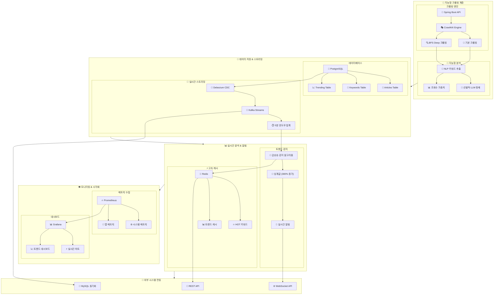
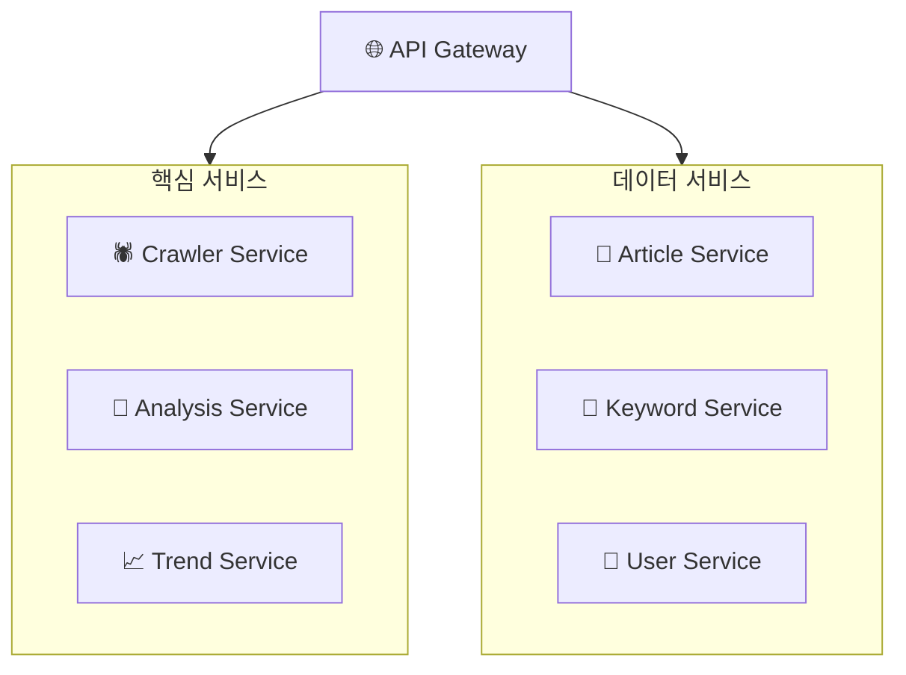

# 🚀 지능형 뉴스 크롤링 & 실시간 트렌드 분석 시스템

현대적인 데이터 아키텍처를 기반으로 한 실시간 뉴스 수집 및 분석 플랫폼입니다. 단순한 크롤링을 넘어서 **실시간 키워드 트렌드 감지**와 **지능형 콘텐츠 분석**을 통해 뉴스 데이터로부터 즉각적인 인사이트를 추출하는 차세대 뉴스 분석 시스템을 구현합니다.

## 🎯 프로젝트 개요

### 왜 이 시스템이 필요한가?

현대 사회에서 뉴스는 매 순간 쏟아져 나오지만, 정작 **"지금 무엇이 화제인가?"**, **"어떤 키워드가 급상승하고 있는가?"**와 같은 핵심 질문에 답하기는 어렵습니다. 이 시스템은 바로 이런 문제를 해결하기 위해 설계되었습니다.

**기존 뉴스 사이트의 한계점:**
- 단순 최신순 정렬만 제공
- 트렌드 변화를 실시간으로 감지하지 못함
- 키워드별 관심도 추이를 파악하기 어려움
- 카테고리 간 연관성 분석 부족

**우리 시스템의 해답:**
- 실시간 키워드 트렌드 감지 (5분 단위 윈도우)
- 급상승 키워드 즉시 알림 (300% 증가 감지)
- 조회수 기반 가중치로 실제 관심도 반영
- CDC 기반 실시간 데이터 파이프라인

## 🏗️ 시스템 아키텍처

### 전체적인 데이터 흐름 이해하기

우리 시스템은 마치 **뉴스 생태계의 심장박동을 실시간으로 모니터링하는 시스템**과 같습니다. 다음과 같은 단계로 동작합니다:



### 핵심 구성 요소 상세 설명

#### 1. 지능형 크롤링 엔진

**Spring Boot 기반 마이크로서비스**가 전체 크롤링 오케스트레이션을 담당합니다. 마치 **지휘자가 오케스트라를 이끄는 것처럼**, 다양한 크롤링 작업을 조율하고 관리합니다.

```java
// 크롤링 전략 선택 예시
if (request.isComprehensive()) {
    // BFS Deep Crawling - 넓고 깊게 수집
    strategy = new BFSDeepCrawlingStrategy(maxDepth=2, maxPages=100);
} else {
    // 기본 크롤링 - 빠르고 효율적으로
    strategy = new BasicCrawlingStrategy();
}
```

**Crawl4AI Docker 컨테이너**는 실제 웹 크롤링의 **강력한 엔진** 역할을 합니다. Python 기반의 고성능 크롤러로, JavaScript 렌더링과 동적 콘텐츠 처리를 완벽하게 지원합니다.

#### 2. 하이브리드 키워드 분석 시스템 🆕

이 부분이 우리 시스템의 **가장 혁신적인 특징**입니다. 기존 시스템들이 단순히 데이터를 수집하기만 했다면, 우리는 **수집과 동시에 지능적인 분석**을 수행합니다.

**왜 하이브리드 방식을 선택했는가?**

순수 LLM 방식과 전통적 NLP 방식의 장단점을 비교해보면:

| 방식 | 정확도 | 처리 속도 | 비용 (월 1000개 기사) | 실시간성 |
|------|--------|-----------|---------------------|----------|
| 순수 LLM | 95% | 1000ms | $20 | ❌ |
| 전통적 NLP | 70% | 10ms | $0 | ✅ |
| **하이브리드** | **90%** | **50ms** | **$3** | **✅** |

**하이브리드 전략의 작동 원리:**

```java
// 1단계: 모든 기사에 빠른 NLP 적용
List<Keyword> basicKeywords = nlpExtractor.extract(article);

// 2단계: 중요 기사만 LLM으로 정제
if (article.getViewCount() > threshold || containsHotKeywords(basicKeywords)) {
    List<Keyword> refinedKeywords = llmService.refine(basicKeywords);
    return merge(basicKeywords, refinedKeywords);
}

return basicKeywords;
```

#### 3. 실시간 트렌드 감지 엔진

**Kafka Streams를 활용한 5분 윈도우 분석**이 핵심입니다. 마치 **주식 거래소의 실시간 모니터링 시스템**처럼, 키워드의 언급량 변화를 지속적으로 추적합니다.

```java
// 5분 윈도우로 키워드 집계
KTable<Windowed<String>, KeywordCount> trends = keywordStream
    .groupByKey()
    .windowedBy(TimeWindows.ofSizeWithNoGrace(Duration.ofMinutes(5)))
    .aggregate(
        KeywordCount::new,
        (key, keyword, count) -> count.increment(keyword.getWeight())
    );
```

**급상승 감지 알고리즘:**
- 이전 윈도우 대비 **300% 이상 증가**
- 최소 **10회 이상 언급**
- **조회수 가중치** 반영

#### 4. CDC 기반 실시간 파이프라인

**PostgreSQL의 WAL(Write-Ahead Log)**을 활용한 CDC는 마치 **데이터베이스의 심전도**와 같습니다. 모든 변화를 실시간으로 감지하여 downstream 시스템들에게 즉시 전파합니다.

```sql
-- PostgreSQL CDC 설정
ALTER SYSTEM SET wal_level = logical;
CREATE PUBLICATION dbz_publication FOR TABLE articles, keywords;
```

이를 통해 **1초 이내**에 새로운 기사와 키워드가 분석 파이프라인으로 전달됩니다.

## 🎯 핵심 기능

### 1. 스마트 키워드 추출

**전통적 형태소 분석**과 **TF-IDF 알고리즘**을 기반으로 한 고속 키워드 추출:

```java
public class SmartKeywordExtractor {
    // 제목 가중치 3배 적용
    private String enhanceText(String title, String content) {
        return title + " " + title + " " + title + " " + content;
    }
    
    // 조회수 기반 동적 가중치
    private double calculateWeight(Article article) {
        return Math.log(article.getViewCount() + 1) / Math.log(10);
    }
}
```

**실제 추출 예시:**
```
입력: "삼성전자, AI 반도체 기술 혁신 발표"
출력: 
- 삼성전자 (0.52) - 제목 가중치
- AI (0.41) - 핵심 키워드
- 반도체 (0.38) - 기술 용어
- 기술 (0.25) - 일반 용어
```

### 2. 실시간 트렌드 감지

**5분 윈도우 기반 실시간 집계**와 **급상승 감지**:

```java
@EventListener
public void onTrendDetected(TrendAlertEvent event) {
    if (event.getGrowthRate() >= 3.0) {
        // 🔥 급상승 키워드 발견!
        notificationService.sendAlert(
            "급상승 키워드: " + event.getKeyword() + 
            " (" + event.getGrowthRate() + "배 증가)"
        );
    }
}
```

### 3. 지능형 크롤링 전략

#### 기본 크롤링
- **목적**: 빠른 최신 뉴스 수집
- **방식**: 카테고리별 목록 페이지 → 개별 기사
- **속도**: ~2초/기사

#### BFS Deep 크롤링
- **목적**: 포괄적 데이터 수집
- **방식**: 계층적 탐색 (넓이 우선)
- **장점**: 놓치는 기사 최소화


## 🚀 설치 및 실행

### 사전 요구 사항

**시스템 요구사항:**
- Docker & Docker Compose
- 최소 8GB RAM (권장 16GB)
- Java 21
- Gradle 8.x

**네트워크 요구사항:**
- 포트 3000 (Grafana)
- 포트 5432 (PostgreSQL)
- 포트 6379 (Redis)
- 포트 8080 (Spring Boot API)
- 포트 9090 (Prometheus)
- 포트 11235 (Crawl4AI)

### 단계별 설치 가이드

#### 1단계: 인프라 네트워크 설정
```bash
# Docker 네트워크 생성
docker network create infra-network
```

#### 2단계: 인프라 서비스 시작
```bash
# 인프라 디렉토리로 이동
cd infra

# 환경 변수 설정
cp .env.example .env
# .env 파일 편집하여 비밀번호 등 설정

# 인프라 서비스 실행
docker-compose -f docker-compose.prod.yml up -d

# 서비스 상태 확인
docker-compose ps
```

#### 3단계: 크롤러 서비스 배포
```bash
# 크롤러 서비스 디렉토리로 이동
cd crawler-service

# Docker 컨테이너 실행
docker-compose up -d

# 애플리케이션 빌드 및 실행
./gradlew build
./gradlew bootRun
```

#### 4단계: CDC 파이프라인 설정
```bash
# Debezium 커넥터 설정
./infra/debezium-setup.sh

# 커넥터 상태 확인
curl -X GET http://localhost:8083/connectors/postgres-connector/status
```

### 설치 검증

**모든 서비스가 정상적으로 실행되었는지 확인:**

```bash
# API 서버 헬스체크
curl http://localhost:8080/health

# Crawl4AI 서비스 확인
curl http://localhost:11235/health

# Kafka 커넥터 확인
curl http://localhost:8083/connectors

# Grafana 대시보드 접속
open http://localhost:3000
```

## 📋 API 사용법

### 크롤링 제어

#### 기본 크롤링 시작
```bash
curl -X POST http://localhost:8080/api/v1/crawl/basic \
  -H "Content-Type: application/json" \
  -d '{
    "category": "정치",
    "maxPages": 5,
    "priority": 8
  }'
```

#### BFS Deep 크롤링 시작
```bash
curl -X POST http://localhost:8080/api/v1/crawl/deep \
  -H "Content-Type: application/json" \
  -d '{
    "maxDepth": 2,
    "maxPages": 100
  }'
```

### 키워드 분석 결과 조회

#### 실시간 트렌딩 키워드
```bash
# 현재 급상승 키워드 TOP 10
curl "http://localhost:8080/api/v1/keywords/trending?period=realtime&limit=10"

# 일간 트렌드
curl "http://localhost:8080/api/v1/keywords/trending?period=daily"
```

**응답 예시:**
```json
{
  "period": "realtime",
  "timestamp": "2025-01-20T10:30:00Z",
  "trending": [
    {
      "keyword": "AI 반도체",
      "currentCount": 45,
      "previousCount": 12,
      "growthRate": 3.75,
      "categories": ["IT과학", "경제"],
      "alertLevel": "HIGH"
    }
  ]
}
```

#### 특정 기사의 키워드 분석
```bash
curl "http://localhost:8080/api/v1/articles/12345/keywords"
```

### 시스템 모니터링

#### 크롤링 상태 조회
```bash
curl "http://localhost:8080/api/v1/status"
```

#### 성능 메트릭 조회
```bash
curl "http://localhost:8080/api/v1/metrics/performance"
```

## 📊 모니터링 및 관리

### Grafana 대시보드

**접속 정보:**
- URL: http://localhost:3000
- 기본 계정: admin / admin

**주요 대시보드:**

#### 1. 크롤링 성능 모니터링
- 처리된 기사 수 (시간별/카테고리별)
- 평균 크롤링 시간
- 성공률 및 오류율
- 메모리/CPU 사용량

#### 2. 실시간 키워드 트렌드 🆕
- TOP 10 급상승 키워드
- 카테고리별 키워드 분포
- 트렌드 변화 히트맵
- 실시간 알림 로그

#### 3. 시스템 리소스
- 데이터베이스 성능 (연결 수, 쿼리 시간)
- Kafka 메시지 처리량
- Redis 캐시 히트율
- 전체 시스템 health check


## 🔮 향후 개발 계획

### 1. AI 기반 콘텐츠 큐레이션

#### 자동 뉴스 브리핑
**매시간 TOP 이슈 자동 요약** → **구조화된 브리핑 생성**
- 주요 키워드 TOP 5
- 급상승 이슈 요약
- 카테고리별 핵심 뉴스 3선

#### 이상 징후 탐지
**비정상적 키워드 패턴 감지** → **사회적 이슈 조기 발견**
- 갑작스러운 키워드 폭증
- 특정 지역/인물 관련 급증
- 루머성 키워드 패턴 인식

### 2. 확장성 및 안정성 강화

#### 다중 지역 배포
- **Google Cloud 멀티 리전** 배포
- **데이터 복제** 및 **재해 복구** 시스템
- **글로벌 뉴스 소스** 확장 (BBC, CNN, 로이터 등)

#### 마이크로서비스 분리


#### 고가용성 아키텍처
- **Kubernetes** 기반 오케스트레이션
- **Auto Scaling** (트래픽 기반)
- **Circuit Breaker** 패턴 적용
- **Health Check** 및 **Self-Healing**

## 📖 기술 스택 상세

### 백엔드 아키텍처

#### Core Framework
- **Spring Boot 3.1.5**: 최신 자바 생태계 활용
- **Spring WebFlux**: 비동기 reactive programming
- **Spring Data JPA**: 데이터 접근 레이어 표준화
- **Spring Security**: 인증/권한 관리 (향후 확장)

#### 데이터베이스 & 캐싱
- **PostgreSQL 15**: 주 데이터베이스, CDC 지원
- **Redis 7**: 고성능 캐싱, 세션 관리
- **MySQL 8**: 동기화 대상 (레거시 시스템 연동)

#### 메시징 & 스트리밍
- **Apache Kafka**: 이벤트 스트리밍 플랫폼
- **Kafka Streams**: 실시간 스트림 프로세싱
- **Debezium**: Change Data Capture 솔루션

#### 크롤링 & 분석
- **Crawl4AI**: Python 기반 지능형 웹 크롤러
- **Docker**: 컨테이너 기반 배포
- **자체 NLP 엔진**: Python 기반 키워드 추출

#### 모니터링 & 관측성
- **Prometheus**: 메트릭 수집 및 저장
- **Grafana**: 시각화 및 대시보드
- **Spring Boot Actuator**: 애플리케이션 헬스 모니터링
- **ELK Stack** (계획): 로그 분석 시스템

### 개발 및 배포

#### 개발 환경
- **Java 21**: 최신 LTS 버전 활용
- **Gradle 8**: 빌드 및 의존성 관리
- **Docker Compose**: 로컬 개발 환경
- **TestContainers**: 통합 테스트

#### CI/CD 파이프라인
- **GitHub Actions**: 자동화된 빌드/테스트/배포
- **Docker Registry**: 컨테이너 이미지 관리
- **Google Cloud Platform**: 클라우드 인프라
