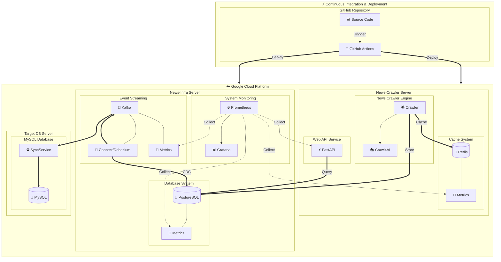

# 뉴스 크롤링 ETL 파이프라인

실시간 뉴스 크롤링과 Kafka를 활용한 데이터 스트리밍 파이프라인을 구축하는 프로젝트입니다. Crawl4AI를 사용하여 네이버 뉴스를 크롤링하고, PostgreSQL에 저장한 후 Debezium을 통해 Kafka로 변경 사항을 캡처하여 다양한 데이터베이스로 실시간 동기화하는 CDC(Change Data Capture) 아키텍처를 구현했습니다.

## 🏗️ 시스템 아키텍처



## 🔍 시스템 구성요소 및 기능

### 1. 크롤링 계층 (Crawling Layer)
- **Crawl4AI**: 비동기적으로 뉴스 데이터(기사, 이미지 등) 수집
  - `urls_crawler.py`: 뉴스 URL 목록 크롤링
  - `contents_crawler.py`: 개별 기사 내용 크롤링
  - `sports_crawler.py`: 스포츠 뉴스 전문 크롤링
- **수집 데이터 유형**:
  - 뉴스 기사 (제목, 내용, 링크)
  - 미디어 파일 (이미지)
  - 카테고리 정보 (정치, 경제, 사회, 생활문화, 세계, IT과학, 스포츠)

### 2. 소스 데이터베이스 계층 (PostgreSQL)
- **테이블 구조**:
  - `articles`: 뉴스 기사 정보 (저장일자 기준 파티셔닝 적용)
  - `media`: 미디어 파일 정보
  - `categories`: 카테고리 정보
  - `article_changes`: 변경 이력 추적
  - `article_keywords`, `article_summaries`, `related_articles`: 확장 테이블
- **CDC 메커니즘**:
  - WAL(Write-Ahead Log) 기반 변경 감지 (`wal_level=logical` 설정)
  - 트리거(`log_article_changes()`)를 통한 변경 사항 기록
  - 레플리케이션 슬롯 및 publication 설정

### 3. 스트리밍 계층 (Streaming Layer)
- **Debezium**:
  - PostgreSQL 커넥터 설정 (`connector-config.json`)
  - `pgoutput` 플러그인을 사용한 WAL 디코딩
  - 변경 데이터 직렬화 및 Kafka로 전송
- **Apache Kafka**:
  - KRaft 모드 설정으로 ZooKeeper 의존성 제거
  - 토픽별 분리: `postgres.public.articles`, `postgres.public.media`, `postgres.public.article_changes`
  - 메시지 포맷: JSON (스키마 없음)

### 4. 타겟 데이터베이스 계층 (MySQL)
- **MySQL 데이터베이스**:
  - 호스트 포트 3307로 매핑 (컨테이너 내부 3306)
  - 동일한 테이블 구조 (`articles`, `media`, `categories`)
  - 전체 텍스트 검색을 위한 인덱스 추가
- **SyncService**:
  - `KafkaConsumerWorker`: Kafka 토픽 구독 및 배치 처리
  - `DebeziumEventHandler`: 이벤트 타입별 처리 (`INSERT`, `UPDATE`, `DELETE`)
  - `MySQLConnectionPool`: 데이터베이스 연결 관리
  - 트랜잭션 관리 및 오류 복구 메커니즘

### 5. API 서비스 계층
- **FastAPI**:
  - `/api/v1/crawl`: 크롤링 작업 트리거
  - `/api/v1/status`: 크롤링 상태 조회
  - `/api/v1/metrics`: Prometheus 메트릭 조회
  - `/api/v1/articles/stats`: 기사 통계 조회
  - `/health`: 헬스체크 엔드포인트

### 6. 모니터링 및 관리 계층
- **Prometheus**: 메트릭 수집 및 저장
  - 수집 대상: 크롤러, PostgreSQL, Redis, Kafka
  - 메트릭 종류: 시스템 리소스, 크롤링 성능, 데이터베이스 성능
- **Grafana**: 대시보드 및 시각화
  - 크롤러 모니터링: 처리된 기사 수, 크롤링 성공률, 실행 시간
  - 시스템 리소스: CPU, 메모리, GC 통계
  - Redis 모니터링: 메모리 사용량, 명령어 처리, 클라이언트 연결
  - 데이터베이스 모니터링: 쿼리 성능, 연결 수, 버퍼 통계

## 📊 모니터링 시스템 상세

### Prometheus 설정
- **수집 주기**: 15초
- **평가 주기**: 15초
- **스크래핑 타임아웃**: 10초
- **데이터 보존 기간**: 15일
- **수집 작업**:
  - `crawler`: 크롤러 메트릭 (API 엔드포인트: `crawler.internal:8000`)
  - `redis`: Redis 메트릭 (Exporter: `redis-exporter:9121`)
  - `prometheus`: 자체 모니터링 메트릭

### Grafana 대시보드
1. **크롤러 실시간 모니터링**:
   - 메모리 및 CPU 사용량 그래프
   - Python GC 수집 객체 수 추적
   - 진행 중인 크롤링 작업 수 표시
   - 카테고리별 처리된 기사 수 그래프
   - 자동 새로고침: 5초

2. **Redis 모니터링**:
   - 명령어 처리 속도 그래프
   - 메모리 사용량 및 사용률
   - 클라이언트 연결 수
   - 키 수 변화 추이
   - 가동 시간 및 거부된 연결 수
   - 자동 새로고침: 10초

3. **시스템 리소스 모니터링**:
   - 프로세스 메모리 사용량 (실제/가상)
   - CPU 사용 시간 추이
   - Python GC 통계 (수집 횟수/시간)
   - 프로세스 가동 시간
   - 자동 새로고침: 10초

### 메트릭 수집
크롤러 서비스는 다음과 같은 메트릭을 수집합니다:
- **카운터 메트릭**:
  - `articles_processed`: 카테고리별 처리된 기사 수
  - `crawl_success`: 카테고리별 성공한 크롤링 수
  - `crawl_failure`: 카테고리별 실패한 크롤링 수
  - `api_requests`: 엔드포인트별 API 요청 수

- **게이지 메트릭**:
  - `crawl_status`: 카테고리별 크롤링 상태
  - `last_execution_time`: 카테고리별 마지막 실행 시간
  - `memory_usage`: 메모리 사용량
  - `cpu_usage`: CPU 사용률
  - `open_files`: 열린 파일 수

- **히스토그램 메트릭**:
  - `crawl_time`: 카테고리별 크롤링 소요 시간
  - `db_operation_time`: 데이터베이스 작업 소요 시간

## ✨ 주요 기능 및 특징
- **실시간 데이터 캡처 및 동기화**: CDC 패턴으로 PostgreSQL의 변경 사항을 MySQL로 실시간 전파
- **다양한 카테고리 크롤링**: 정치, 경제, 사회, 생활문화, 세계, IT과학, 스포츠 등 다양한 카테고리 지원
- **비동기 크롤링**: asyncio와 aiohttp를 활용한 효율적인 크롤링
- **캐싱 및 중복 방지**: Redis를 활용한 URL 중복 제거 및 결과 캐싱
- **확장성 있는 아키텍처**: 분산 처리가 가능한 메시지 기반 설계
- **스케줄링**: APScheduler를 활용한 주기적 크롤링
- **모니터링 및 알림**: Prometheus와 Grafana를 통한 전체 시스템 모니터링
- **자동화된 배포**: GitHub Actions를 활용한 CI/CD 파이프라인

## 🚀 설치 및 실행 방법

### 사전 요구 사항
- Docker 및 Docker Compose
- Git
- 최소 4GB RAM 이상의 시스템 (권장: 8GB)

### 설치 및 실행 단계
1. 저장소 클론:
   ```bash
   git clone <repository-url>
   cd <repository-directory>
   ```

2. 환경 변수 설정:
   ```bash
   cp .env.example .env
   # .env 파일을 편집하여 환경 변수 설정
   ```

3. 인프라 서비스 실행:
   ```bash
   cd infra
   docker-compose -f docker-compose.prod.yml up -d
   ```

4. 크롤러 서비스 실행:
   ```bash
   cd CrawlingServer
   docker-compose -f docker-compose.prod.yml up -d
   ```

5. Debezium 커넥터 설정:
   ```bash
   cd infra
   ./debezium-setup.sh
   ```

6. MySQL 동기화 서비스 실행:
   ```bash
   cd targetDB1
   docker-compose up -d
   python SyncService.py
   ```

7. 서비스 상태 확인:
   ```bash
   docker ps
   # 또는 각 컨테이너의 로그 확인
   docker logs -f crawler
   ```

8. API 테스트:
   ```bash
   # 특정 카테고리 크롤링 시작
   curl -X POST "http://localhost:8080/api/v1/crawl?category=IT%EA%B3%BC%ED%95%99"
   
   # 크롤링 상태 확인
   curl "http://localhost:8080/api/v1/status"
   
   # 기사 통계 확인
   curl "http://localhost:8080/api/v1/articles/stats"
   ```

9. 모니터링 대시보드 접속:
   - Grafana: http://localhost:3000 (기본 계정: admin/비밀번호는 .env 파일 참조)
   - Prometheus: http://localhost:9090

## 🧩 시스템 구성요소 상세

### 인프라 컨테이너
- **postgres**: PostgreSQL 데이터베이스 (WAL 레벨 논리적 복제 활성화)
- **kafka**: KRaft 모드의 Apache Kafka
- **kafka-connect**: Debezium 커넥터를 실행하는 Kafka Connect
- **prometheus**: 메트릭 수집 및 저장
- **grafana**: 대시보드 및 시각화

### 크롤러 컨테이너
- **crawler**: FastAPI 기반 크롤링 서비스
- **crawl4ai**: Playwright 기반 웹 크롤링 엔진
- **redis**: 캐싱 및 중복 방지용 인메모리 데이터베이스
- **redis-exporter**: Redis 메트릭 수집기

### 타겟 데이터베이스 컨테이너
- **mysql**: MySQL 데이터베이스
- **sync-service**: Kafka 컨슈머 및 MySQL 동기화 서비스

## 📊 프로젝트 현황 및 진행상황

### 완료된 항목
- ✅ 네이버 뉴스 전체 카테고리 크롤링 
- ✅ Kafka 연결을 통한 실시간 데이터 스트리밍
- ✅ Debezium을 활용한 DB 테이블 변경사항 실시간 CDC 처리
- ✅ Prometheus + Grafana로 모니터링 및 시각화
- ✅ MySQL로의 실시간 데이터 동기화

### 진행 중인 항목
- 🔄 비동기 + 멀티스레드 방식 크롤링으로 인한 크롤링 시간 단축
- 🔄 이미지 데이터 추가 수집
- 🔄 불필요한 HTML 태그 필터링 및 데이터 필터링
- 🔄 배포 및 CI/CD 파이프라인 구축 (GitHub Actions 사용)

### 향후 계획
- 📝 기사 제목 해싱 작업 및 해당 해시로 캐시로 중복 크롤링 삭제
- 📝 ETL 작업 확장 (vectorDB, ElasticSearch 등 다양한 DB로 전달)
- 📝 크롤링 결과를 바로 전처리하여 Kafka Streams로 실시간 처리
- 📝 로그 Kafka 저장 및 일별 평균 크롤링 시간 분석

## 📋 디렉토리 구조

```
├── .github                  # GitHub Actions 워크플로우
│   ├── scripts              # 배포 스크립트
│   └── workflows            # CI/CD 워크플로우
├── CrawlingServer           # 크롤러 서비스
│   ├── services             # 크롤링 서비스 구현
│   │   ├── crawlers         # 크롤러 모듈
│   │   └── db               # 데이터베이스 연동
│   ├── docker-compose.yml   # 개발용 Docker Compose
│   ├── Dockerfile           # 개발용 Dockerfile
│   ├── Dockerfile.prod      # 프로덕션용 Dockerfile
│   └── main.py              # FastAPI 애플리케이션
├── infra                    # 인프라 설정
│   ├── grafana              # Grafana 대시보드 및 설정
│   ├── init-postgres        # PostgreSQL 초기화 스크립트
│   ├── prometheus           # Prometheus 설정
│   ├── docker-compose.yml   # 개발용 Docker Compose
│   └── docker-compose.prod.yml # 프로덕션용 Docker Compose
└── targetDB1                # MySQL 동기화 서비스
    ├── SyncService.py       # Kafka 컨슈머 및 동기화 구현
    ├── docker-compose.yml   # MySQL Docker Compose
    └── schema.sql           # MySQL 스키마 정의
```

## 📖 참고 자료
- [Crawl4AI 문서](https://example.com/crawl4ai-docs)
- [Debezium 문서](https://debezium.io/documentation/)
- [Apache Kafka 문서](https://kafka.apache.org/documentation/)
- [FastAPI 문서](https://fastapi.tiangolo.com/)
- [Prometheus 문서](https://prometheus.io/docs/)
- [Grafana 문서](https://grafana.com/docs/)
