# ETL 파이프라인 구축하기 + Naver 기사 크롤링
ETL 파이프 라인 구축과 이를 Kafka 를 활용하여 실시간 스트리밍 데이터 처리를 해보기 위한 프로젝트입니다.

Crwal4AI를 활용하여 크롤링 진행 후 이를 DB에 저장한 후 debezium을 활용하여 Kafka에 저장 후 실시간 데이터 스트리밍 파이프라인을 구축하는 프로젝트입니다.

[현재 프로젝트의 아키텍쳐]
## 🏗️ Architecture

```mermaid
flowchart TB
    %% GitHub Section
    subgraph CI_CD["⚡ Continuous Integration & Deployment"]
        subgraph GitHub["GitHub Repository"]
            direction LR
            code["💻 Source Code"]
            actions["🚀 GitHub Actions"]
            code -.->|Trigger| actions
        end
    end

    %% GCP Section
    subgraph GCP["☁️ Google Cloud Platform"]
        %% Crawler VM
        subgraph CrawlerVM["News-Crawler Server"]
            direction TB
            subgraph API["Web API Service"]
                direction LR
                fastapi["⚡ FastAPI"]
            end
            
            subgraph Crawler["News Crawler Engine"]
                direction LR
                crawler["🕷️ Crawler"]
                playwright["🎭 Playwright"]
                crawler --> playwright
            end

            subgraph CacheLayer["Cache System"]
                direction LR
                redis[("🔸 Redis")]
                redis_exp["📡 Metrics"]
                redis --- redis_exp
            end
        end

        %% Infra VM
        subgraph InfraVM["News-Infra Server"]
            direction TB
            subgraph DB["Database System"]
                direction LR
                postgres[("🐘 PostgreSQL")]
                pg_exp["📡 Metrics"]
                postgres --- pg_exp
            end
            
            subgraph Stream["Event Streaming"]
                direction LR
                kafka["🔹 Kafka"]
                connect["🔄 Connect"]
                kafka_exp["📡 Metrics"]
                kafka --- connect
                kafka --- kafka_exp
            end
            
            subgraph Monitor["System Monitoring"]
                direction LR
                prometheus["🔥 Prometheus"]
                grafana["📊 Grafana"]
                prometheus --> grafana
            end
        end
    end

    %% Deployment Flow
    actions ==>|Deploy| CrawlerVM
    actions ==>|Deploy| InfraVM

    %% Data Flow
    crawler ==>|Store| postgres
    crawler ==>|Cache| redis
    fastapi ==>|Query| postgres
    kafka ==>|CDC| postgres
    
    %% Monitoring Flow
    prometheus -.->|Collect| pg_exp
    prometheus -.->|Collect| kafka_exp
    prometheus -.->|Collect| redis_exp

    %% Styling
    classDef githubStyle fill:#2b3137,color:#fff,stroke:#333,stroke-width:2px,rx:8
    classDef postgresStyle fill:#336791,color:#fff,stroke:#333,stroke-width:2px,rx:8
    classDef kafkaStyle fill:#231f20,color:#fff,stroke:#333,stroke-width:2px,rx:8
    classDef prometheusStyle fill:#e6522c,color:#fff,stroke:#333,stroke-width:2px,rx:8
    classDef grafanaStyle fill:#F46800,color:#fff,stroke:#333,stroke-width:2px,rx:8
    classDef redisStyle fill:#dc382d,color:#fff,stroke:#333,stroke-width:2px,rx:8
    classDef fastapiStyle fill:#009688,color:#fff,stroke:#333,stroke-width:2px,rx:8
    classDef vmStyle fill:#f8f9fa,color:#333,stroke:#4a4a4a,stroke-width:3px,rx:10
    classDef layerStyle fill:#ffffff,color:#333,stroke:#666,stroke-width:2px,stroke-dasharray: 5 5,rx:8
    classDef cicdStyle fill:#2b3137,color:#fff,stroke:#333,stroke-width:2px,rx:10
    classDef gcpStyle fill:#4285f4,color:#fff,stroke:#333,stroke-width:2px,rx:10
    classDef metricsStyle fill:#6c757d,color:#fff,stroke:#333,stroke-width:1px,rx:8

    %% Apply styles
    class GitHub,code,actions githubStyle
    class postgres,pg_exp postgresStyle
    class kafka,connect,kafka_exp kafkaStyle
    class prometheus prometheusStyle
    class grafana grafanaStyle
    class redis,redis_exp redisStyle
    class fastapi fastapiStyle
    class CrawlerVM,InfraVM vmStyle
    class GCP gcpStyle
    class API,Crawler,CacheLayer,DB,Stream,Monitor layerStyle
    class CI_CD cicdStyle
    class redis_exp,pg_exp,kafka_exp metricsStyle

```

## 🔍 System Components

### 1. Crawling Layer
- **Crawl4AI**: Collects news data including articles, media files, and categories
- Data Types:
  - News Articles (titles, content, links)
  - Media Files (images, videos)
  - Category Information

### 2. Source Database Layer (PostgreSQL)
- **Core Tables**:
  - articles: News article information
  - media: Media file information
  - categories: Category information
- **CDC Mechanism**:
  - article_changes: Change history tracking
  - Triggers: Change detection
  - WAL: Transaction logs

### 3. Streaming Layer
- **Debezium**:
  - Connector: PostgreSQL WAL monitoring
  - Serializer: Data serialization
- **Apache Kafka**:
  - Broker: Message queue management
  - Topics: Dedicated topics per table

### 4. Target Database Layer (MySQL)
- **Synchronized Tables**:
  - articles: News articles
  - media: Media information
  - categories: Categories

## ✨ Key Features
- Real-time data capture and synchronization
- Reliable data transmission
- Scalable architecture
- Fault recovery mechanism

 
[Issues]

* 대규모 데이터 스트리밍에 더 적합한 방식은 크롤링 서버 > Kafka > ETL 파이프라인 (Postgresql => Pyspark => MySQL)라고 생각되어 해당 방식으로 아키텍처 변경 예정

* Crwal4AI를 활용하여 웹 크롤링을 진행 예정 더 유연한 LLM 연결, 동적 크롤링 등 더 많은 이점이 있는 것으로 판단됨

* Crwal4AI의 schema 추출법을 명시하는 것이지 결국 Result에는 해당 페이지의 전문 HTML을 가져오며, 후에 extracted_content를 실행할때 해당 데이터 추출 스키마에 따라 데이터 추출이 가능하다, 한 result에 여러 스키마를 정의하여 데이터       추출이 가능한지는 추후 알아봐야 할 것

## Todo

* IT 관련 뉴스가 아닌 뉴스 탭의 모든 기사 크롤링 => `완료`
* 이미지 데이터도 추가 수집
* 불필요한 HTML 태그 필터링 및 데이터 필터링
* 비동기 + 멀티스레드 방식 크롤링으로 인한 크롤링 시간 단축 => 멀티 스레드 적용 시 캐시 정합성 문제로 싱글 스레드인 Redis 도입 검토
* 기사 제목 해싱 작업 및 해당 해시로 캐시로 중복 크롤링 삭제
* Kafka 연결을 통한 실시간 데이터 스트리밍 => `완료`
* 배포 및 CI/CD 구축
  * 초기에는 크롤링 결과를 JSON 파일로 저장 후 이를 Kafka에 저장하는 방식 => `완료`
  * 현재는 Debezium을 활용한 DB 테이블 변경사항 실시간 캡처하여 kafka로 전달하는 CDC 처리 중 => `완료`
  * 이후에는 크롤링 결과값을 바로 전처리 하여 kafka streams를 활용하여 실시간으로 처리하는 방식으로 변경 예정 => 멀티스레드와 결합시 전처리 방법에 대한 고민은 한번 더 필요
* 로그 Kafka 저장 및 일별 평균 크롤링 시간 기록 => `Prometheus + Grafana 로 모니터링 및 시각화 완료`
* ETL 작업 시행(vectorDB, ElasticSearch, MySQL 등 다양한 DB로 전달 예정)
